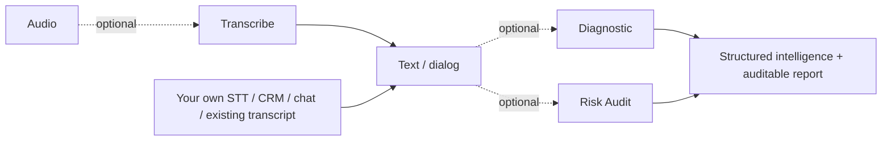

# FalaAI.Api — .NET SDK for Conversation Intelligence, Speech Analytics & Compliance

[](https://www.nuget.org/packages/FalaAI.Api)
[](https://www.nuget.org/packages/FalaAI.Api)
[](LICENSE)
[](https://github.com/ActionTecBr/falaai-api-dotnet/actions/workflows/ci.yml)
[](https://actiontecbr.github.io/falaai-api-dotnet/)

Official **.NET / C# SDK** for the **FalaAI API** — transcribe audio, analyze conversations and audit compliance (COPC CX, ISO 18295-1). **Use each API independently or combine them into your own pipeline.**

> Analyze calls, contact-center recordings, voice notes, chat and email. Get speaker-separated transcripts, summaries, reasons, actions, sentiment and a **compliance risk score**.

## Use any FalaAI API independently

FalaAI is a set of **independent REST APIs**. You **do not** need FalaAI Transcription to use FalaAI analysis or compliance auditing. If your application already has a transcript (your own speech-to-text, a chatbot transcript, CRM history or messaging), send that text straight to the analysis APIs.

| If you have... | Use |
|---|---|
| Audio but no transcript | `SpeechApi` — Transcription |
| An existing transcript | `AnalysisApi` — Diagnostic |
| A transcript needing compliance analysis | `AnalysisApi` — Risk Audit |
| An existing transcript needing both | Diagnostic + Risk Audit |
| Your own STT provider (Whisper, Deepgram...) | Skip FalaAI Transcription |

```text
Your STT                             ->  FalaAI Diagnostic  ->  FalaAI Risk Audit
Telegram voice -> your STT           ->  FalaAI Risk Audit
3CX / Asterisk / Genesys transcript  ->  FalaAI Diagnostic  ->  FalaAI Risk Audit
CRM conversation                     ->  FalaAI Risk Audit
```

> Integrate FalaAI at **any point** of your pipeline — not only at capture/transcription.

## Use the APIs the way you want

Every FalaAI API is **independent and optional** — chain any subset, in any combination.



> Skip **Transcribe** if you already have text. Call only **Diagnostic**, only **Risk Audit**, or both — whatever your case needs.

## Install

```bash
dotnet add package FalaAI.Api
```

Requires **.NET 8.0+** (`net8.0`).

## Quickstart

### 1. Get an API key
Create a free account and copy your `fai_` key: <https://falaai.action.tec.br/api/auth> (or the [Dashboard](https://falaai.action.tec.br/api/dashboard)).

### 2. Set environment variables

```bash
FALAAI_BASE_URL=https://api01-falaai.action.tec.br
FALAAI_API_KEY=fai_xxxxxxxx
```
PowerShell: `$env:FALAAI_BASE_URL="https://api01-falaai.action.tec.br"; $env:FALAAI_API_KEY="fai_xxxxxxxx"`

### 3. Transcribe a call (audio -> text)

```csharp
using System;
using System.IO;
using FalaAI.Api.Api;
using FalaAI.Api.Client;

var config = new Configuration
{
    BasePath = Environment.GetEnvironmentVariable("FALAAI_BASE_URL"),
    AccessToken = Environment.GetEnvironmentVariable("FALAAI_API_KEY"),
};

using var stream = File.OpenRead("call.mp3");
var file = new FileParameter("call.mp3", "audio/mpeg", stream);

var transcription = await new SpeechApi(config)
    .CreateTranscriptionV1AudioTranscriptionsPostAsync(
        file,
        model: "falaai-transcribe-1",
        language: "pt",
        clientReferenceId: "call_202609271408");

Console.WriteLine(Newtonsoft.Json.JsonConvert.SerializeObject(transcription, Newtonsoft.Json.Formatting.Indented));
```

Expected response (abridged):

```json
{
  "id": "tr-...",
  "object": "transcription",
  "model": "falaai-transcribe-1",
  "language": "por",
  "duration_seconds": 25.0,
  "text": "...",
  "dialog": "Speaker 1: [...] ...",
  "usage": { "audio_seconds": 25.0, "credits_consumed": 25, "processing_ms": 951 }
}
```

> Only need analysis? **Skip step 3** and call `AnalysisApi` with your own transcript (use the `text` field for a plain transcript; `dialog` + `audioEvents` for a diarized one).

### 4. Analyze or audit an existing transcript (no transcription needed)

```csharp
using FalaAI.Api.Api;
using FalaAI.Api.Client;
using FalaAI.Api.Model;

var config = new Configuration
{
    BasePath = Environment.GetEnvironmentVariable("FALAAI_BASE_URL"),
    AccessToken = Environment.GetEnvironmentVariable("FALAAI_API_KEY"),
};
var analysis = new AnalysisApi(config);

var transcript = "Good morning, how can I help? I need to cancel my subscription.";

// 5 analyses in one call: summary, reason, action, topic, sentiment
var diagnostic = await analysis.CreateDiagnosticV1AnalyzeDiagnosticPostAsync(
    new DiagnosticRequest(text: transcript, language: "pt-BR", durationSeconds: 81.46m));

// Compliance risk score + violations + auditable report
var audit = await analysis.CreateRiskAuditV1AnalyzeRiskAuditPostAsync(
    new RiskAuditRequest(text: transcript, language: "pt-BR", responseLanguage: "pt-BR", durationSeconds: 81.46m));
```

## What is FalaAI API?

FalaAI API is an **AI conversation-intelligence API** for analyzing customer-service, contact-center, sales, messaging and other business conversations. It combines speech-to-text (with speaker diarization and audio-event detection), conversation analysis (summary, contact reason, action taken, topic classification, sentiment) and a **compliance/risk audit** against **COPC CX** and **ISO 18295-1**. Conversation content is processed and discarded (zero-storage).

## What can you do with FalaAI?

- **Transcribe** audio to text with speaker separation and audio events (cough, sigh...).
- **Diagnose** a conversation: executive summary, reason, action taken, topic and sentiment.
- **Audit** conversations: compliance risk score, detections/violations and an auditable HTML report.
- **Track usage** by log and by API key.
- **Manage webhooks** and **email alerts**.
- **Health/version** checks (public endpoints).

## Use cases

- **Contact center / Quality** — audit 100% of conversations instead of a sample.
- **Compliance / Legal** — auditable evidence for audits and disputes.
- **CX / Operations** — risk score, sentiment and reason per conversation.
- **Sales** — analyze sales calls and extract structured outcomes.
- **BI / Data** — typed JSON ready for your database or analytics stack.

## SDK surface (.NET)

| Class | Namespace | Purpose |
|---|---|---|
| `Configuration` | `FalaAI.Api.Client` | `BasePath`, `AccessToken` |
| `HealthApi` | `FalaAI.Api.Api` | `HealthCheckAsync`, `HealthCheckHeadAsync` |
| `SpeechApi` | `FalaAI.Api.Api` | `CreateTranscriptionV1AudioTranscriptionsPostAsync` |
| `AnalysisApi` | `FalaAI.Api.Api` | `CreateDiagnosticV1AnalyzeDiagnosticPostAsync`, `CreateRiskAuditV1AnalyzeRiskAuditPostAsync` |
| `UsageApi` | `FalaAI.Api.Api` | usage log and usage by key |
| `WebhooksApi` | `FalaAI.Api.Api` | list / create / update / delete webhooks |
| `EmailAlertsApi` | `FalaAI.Api.Api` | list / create / update / delete email alerts |
| `VersionApi` | `FalaAI.Api.Api` | `GetVersionApiVersionGetAsync` |
| Models | `FalaAI.Api.Model` | `TranscriptionResponse`, `DiagnosticRequest`/`DiagnosticResponse`, `RiskAuditRequest`, `RiskAuditV2Response`, `Participant`, `DiagnosticAudioEvent` |
| `FileParameter` | `FalaAI.Api.Client` | multipart file upload |

> Model IDs: `falaai-transcribe-1`, `falaai-diagnostic-1`, `falaai-risk-audit-1`.

## Examples

Runnable examples in [`examples/`](./examples): `HealthExample.cs`, `TranscribeExample.cs`, `DiagnoseExample.cs`, `AuditExample.cs`.

## Authentication

Every request requires `Authorization: Bearer fai_<your_key>` — except the public endpoints (`GET/HEAD /v1/health`, `GET /api/version`). Set the key with `Configuration.AccessToken` (or the `FALAAI_API_KEY` env var).

## Error handling

Non-2xx responses throw `FalaAI.Api.Client.ApiException` (carries the HTTP error code). Wrap calls in `try/catch` and configure retries with `RetryConfiguration` / `RequestOptions`.

```csharp
try
{
    var health = await new HealthApi(config).HealthCheckAsync();
    Console.WriteLine(health.Status);
}
catch (FalaAI.Api.Client.ApiException ex)
{
    Console.Error.WriteLine(ex.Message);
}
```

## Where to integrate (this SDK)

FalaAI is language-independent; this package targets **.NET / C#** backends. Your target platform does not need to be built in .NET.

| Platform / environment (this SDK's language: **.NET / C#**) | Integration |
|---|---|
| **Microsoft Dynamics 365** | `FalaAI.Api` (C#) |
| **Microsoft Teams** apps | `FalaAI.Api` (+ Microsoft Teams .NET SDK) |
| **ASP.NET / Web API** | `FalaAI.Api` |
| **Windows service / worker** | `FalaAI.Api` |
| **.NET CRM / ERP / contact-center backend** | `FalaAI.Api` |
| Other stacks (3CX, Salesforce, Odoo, Genesys...) | REST / cURL — [API reference](https://api01-falaai.action.tec.br/docs) (or the SDK for that backend's language) |

> These are **integration examples**, not certified native integrations. Any platform can integrate through **REST / cURL** — the standard, language-independent path — see the [API reference](https://api01-falaai.action.tec.br/docs). Authenticated calls use `Authorization: Bearer fai_<key>`.

## Production usage

- Store API keys in environment variables or a secret manager — never hard-code.
- Use `CancellationToken` for long-running requests.
- Handle `FalaAI.Api.Client.ApiException` explicitly.
- Configure `RetryConfiguration` to match your application's retry policy.

## Compatibility

| Requirement | Version |
|---|---|
| .NET | 8.0+ (`net8.0`) |
| API | v1.21.49 |

## Documentation

- **SDK docs (this language):** <https://actiontecbr.github.io/falaai-api-dotnet/>
- **API reference (Swagger UI):** <https://api01-falaai.action.tec.br/docs>
- **OpenAPI contract:** <https://api01-falaai.action.tec.br/openapi.json>
- **Sandbox (run real requests):** <https://falaai.action.tec.br/api#playground>
- **Quickstart:** <https://falaai.action.tec.br/api/quickstart>
- **Product page:** <https://falaai.action.tec.br/api>

## Versioning

Semantic versioning; the SDK version tracks the API version (`1.21.49`). See [CHANGELOG.md](CHANGELOG.md) and [Releases](https://github.com/ActionTecBr/falaai-api-dotnet/releases).

## Security

See [SECURITY.md](SECURITY.md). Never commit real keys — use environment variables.

## Contributing

See [CONTRIBUTING.md](CONTRIBUTING.md).

## License

[MIT](LICENSE).

## Links

- Website: <https://falaai.action.tec.br>
- API base URL: <https://api01-falaai.action.tec.br>
- GitHub organization: <https://github.com/ActionTecBr>
- Other SDKs: Python, Node.js, PHP, Go, Ruby, Java.

### Platform documentation (orientation)

- Microsoft Dynamics 365 — <https://learn.microsoft.com/en-us/dynamics365/>
- Microsoft Teams — <https://learn.microsoft.com/en-us/microsoftteams/platform/>
- ASP.NET Core — <https://learn.microsoft.com/en-us/aspnet/core/>